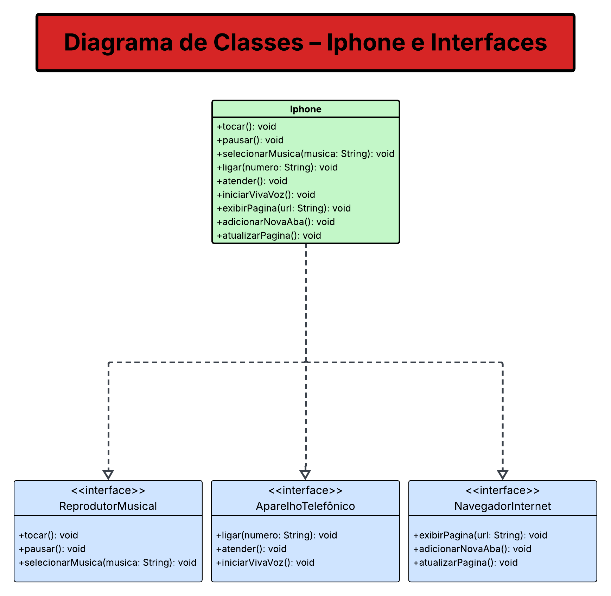

# 📱 Projeto iPhone em Java

Este projeto simula o funcionamento básico de um iPhone com base em três funcionalidades principais:
- **Reprodutor musical**
- **Aparelho telefônico**
- **Navegador de internet**

O projeto segue princípios de **programação orientada a objetos** e aplica o uso de **interfaces em Java**.

---

## 🔧 Funcionalidades

### ReprodutorMusical
- `tocar()`
- `pausar()`
- `selecionarMusica(musica: String)`

### AparelhoTelefonico
- `ligar(numero: String)`
- `atender()`
- `iniciarVivaVoz()`

### NavegadorInternet
- `exibirPagina(url: String)`
- `adicionarNovaAba()`
- `atualizarPagina()`

---

## 🧩 Estrutura de Classes

O diagrama abaixo mostra a relação entre a classe `Iphone` e as interfaces implementadas:



> 💡 O arquivo do diagrama está localizado em `docs/uml-iphone-diagrama.png`.

---

## 🚀 Como Executar

1. Clone o projeto:
```bash
git clone https://github.com/Bifaniii/iPhone.git
```
2. Abra no IntelliJ ou outro IDE Java.
3. Compile e execute a classe Iphone.java com métodos de teste implementados no main().
